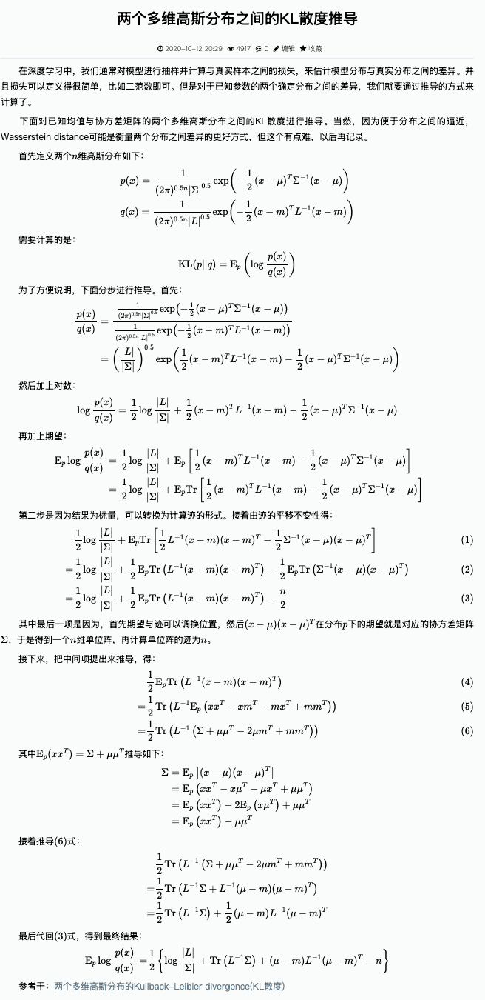

# 散度

## 期望

## 熵

## 交叉熵

​	交叉熵（cross-entropy）和 KL 散度联系很密切。
$$
H(P,Q) = -E_{x\sim P}logQ(x) = -\sum_{i=1}^{N}P(x_{i})logQ(x_{i})
$$
​	交叉熵$H(P,Q)=H(P)+D_{KL}(P||Q)$。其中$H(P)$（即$H(x)$其中$x\sim P$）为分布$P$的熵，$D_{KL}(P||Q)$为两个分布的KL散度

**性质：**

* 非负
* 和KL散度相同，交叉熵不具备对称性，即$H(P,Q)\not= H(Q,P)$
* 对同一个分布求熵等于对其求熵

## KL 散度

​	KL散度（Kullback - Leibler divergence），也称为相对熵，用于衡量两个概率分布之间的差异（从一个分布转移到另一个分布所需要付出的代价）。

**性质：**

* 非对称，即$D_{KL}(P||Q) \not= D_{KL}(Q||P) $

* 当两个分布没有重叠时，两个KL散度没法计算

​	**1. 当X为离散变量时**
$$
D_{KL}(P||Q) = \sum p(i)log\frac{p(i)}{q(i)}
$$
​	**离散状态举例:**

分布$P:{1,2,3}$，分布$Q:{1,2,3}$  概率分别是$p(1)=\frac{1}{2} ,p(2)=\frac{1}{3} ,p(3)=\frac{1}{6} ,q(1)=\frac{1}{3},q(2)=\frac{1}{3},q(3)=\frac{1}{3}$
$$
D_{KL}(P||Q) = p(1)log\frac{p(1)}{q(1)}+ p(2)log\frac{p(2)}{q(2)}+ p(3)log\frac{p(3)}{q(3)}
$$
​	**2. 当X为连续变量时**
$$
D_{KL}(P||Q) = \int\limits_{-\infty}^{+\infty} P(x)log\frac{P(x)}{Q(x)}\mathrm{d}x  \\
$$
​	根据期望的定义（上为离散型，下为连续形分布）：
$$
E_{p}[Y]=\sum P(x)Y(x)
\\E_{p}=\int\limits_{-\infty}^{+\infty} P(x)Y(x)\mathrm{d}x
$$
​	所以 $D_{KL}(P||Q) = E_{P}[log\frac{P(X)}{Q(X)} ]$，可以理解为**在期望表示形式下，KL 散度就是在[概率分布]下，$log\frac{P(x)}{Q(x)}$的期望。它在信息论、机器学习等领域有广泛的应用，例如在变分推断中用于衡量近似后验分布和真实后验分布之间的差异。**

 	**3. 两个多元正太分布之间的KL散度**

​	

## JS散度

​	对KL散度进行补充

**特点：**

* 对称性

## Wasserstein distance

