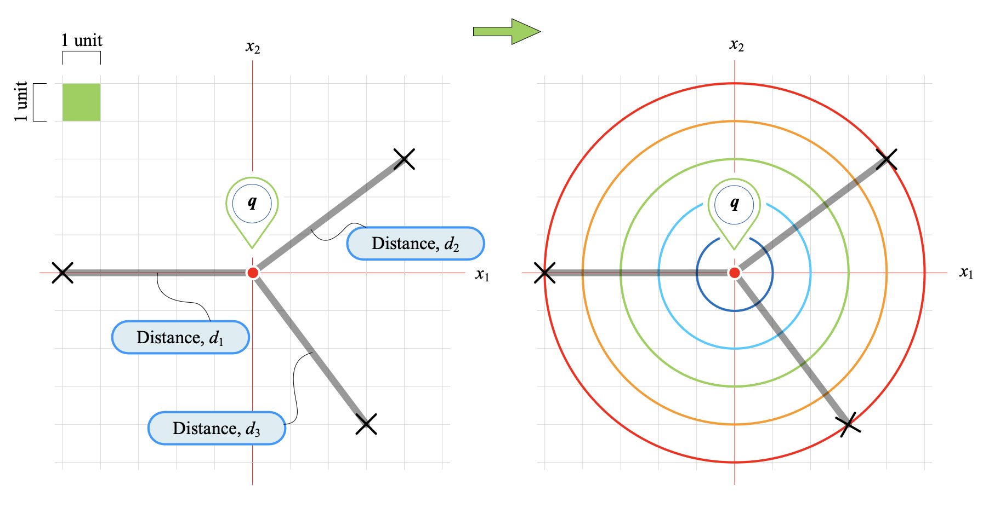
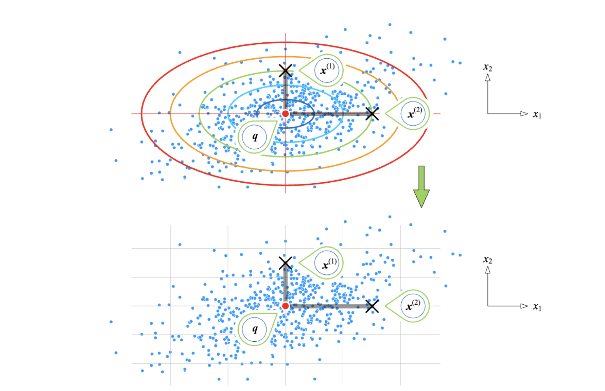
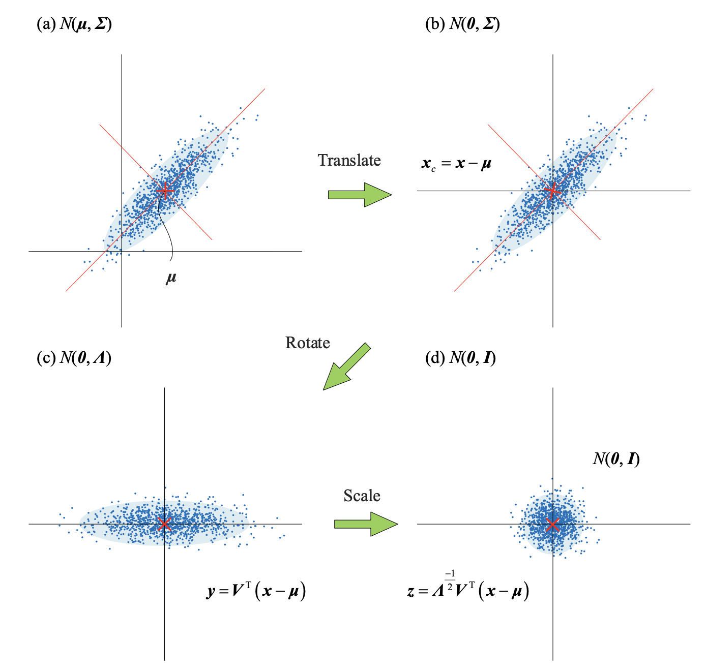
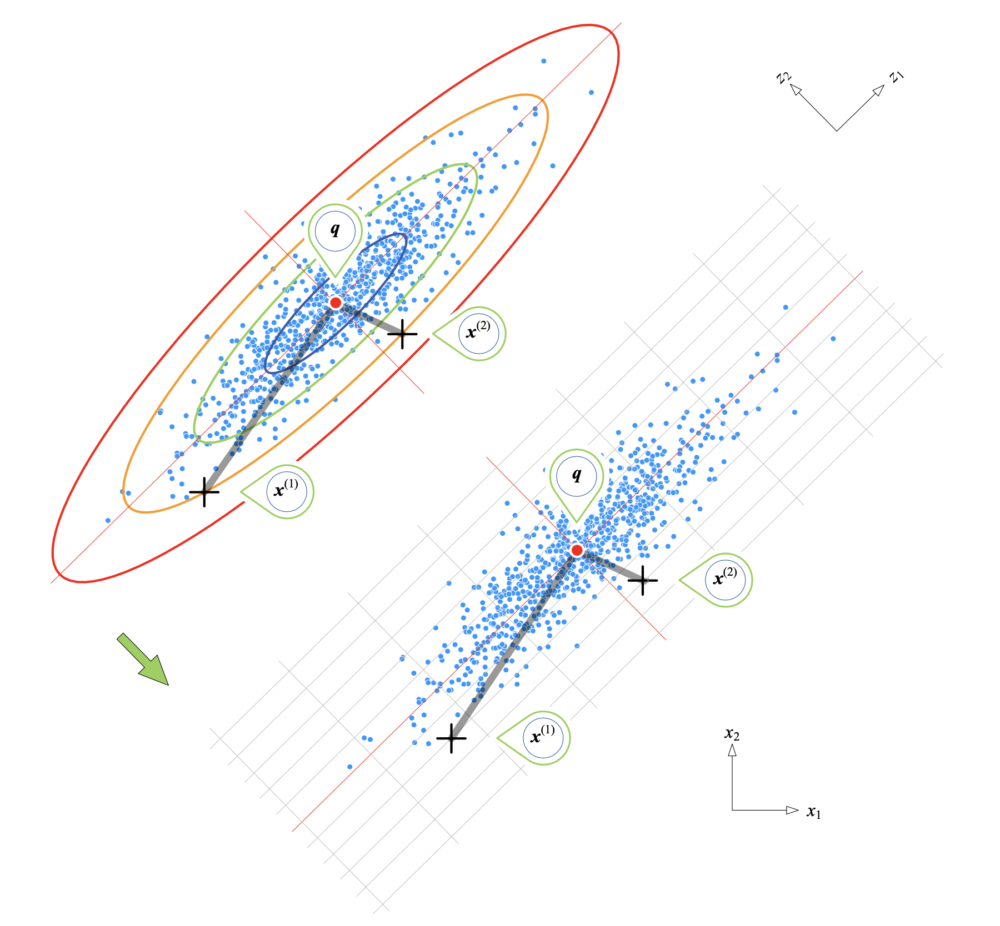
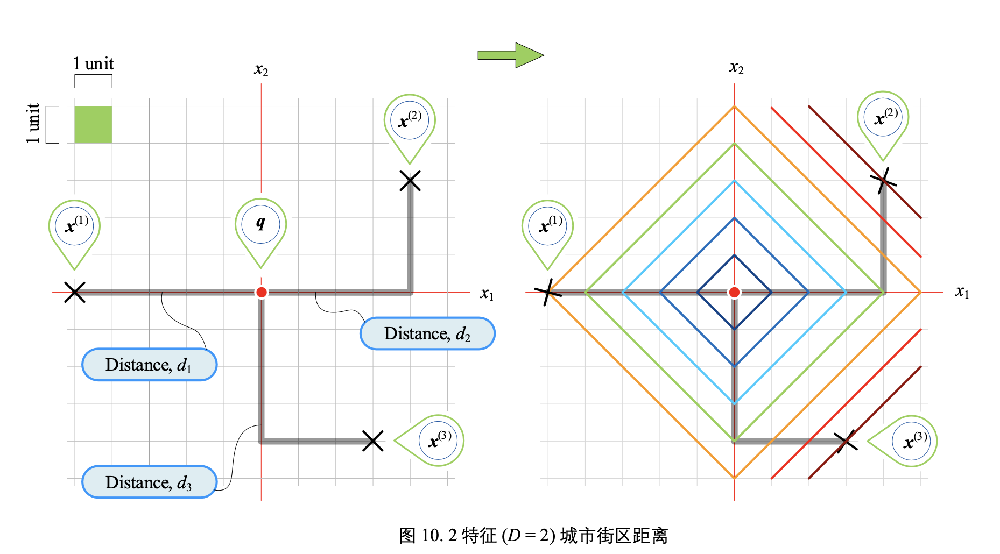
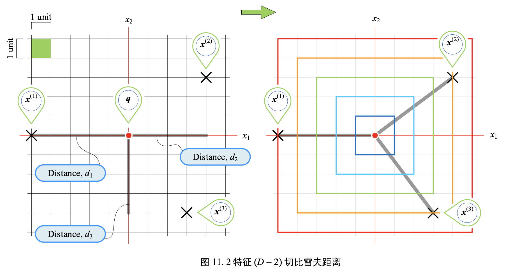
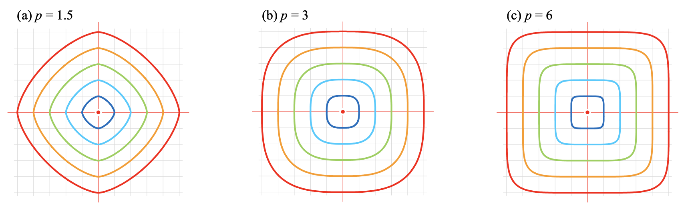

# 距离度量（相似度指标）------几何📐

## 1. 欧式距离(同心圆)

​	欧式距离也称欧几里得距离，是最常见的距离度量，衡量的是多维空间中两个点之间的绝对距离 。**欧式距离定义**：欧氏距离（ Euclidean distance）是一个通常采用的距离定义，它是在m维空间中两个点之间的真实距离。
$$
d(x,q)= dist(x,q) =\sqrt{(x-q)^T(x-q)}
$$

$$
d(x,q) =\sqrt{([x_1,x_2...x_D]-[q_1,q_2...q_D])  ([x_1,x_2...x_D]-[q_1,q_2...q_D])^T}
$$

​	其中D表示特征的维度。  

​	欧式距离相当于L2范数（范数：具有距离概念的函数）。**L2范数通常会被用来做优化目标函数的正则化项，防止模型为了迎合训练集而过于复杂造成过拟合的情况，从而提高模型的泛化能力**。
$$
||x||_{2}=\sqrt{\sum_{i=1}^{n}x_{i}^2}
$$
**缺陷**

* **x，y特征的尺度完全不一样：**身高和体重，这两个变量拥有不同的单位标准，也就是有不同的scale。比如身高用毫米计算，而体重用千克计算，显然差10mm的身高与差10kg的体重是完全不同的。但在普通的欧氏距离中，这将会算作相同的差距。
* **特征之间存在相关性：**身高和体重两个特征之间存在一定的相关性，并非正交，正交坐标系下不好计算

## 2. 标准化欧式距离（正椭圆）

​	**解决问题：特征值单位不统一（通过引入每个距离的均方差）**
$$
d(x,q)=\sqrt{(x-q)^TV^{-1}(x-q)}
$$

$$
V = diag(diag(\sum ))=diag\left \{ diag\begin{bmatrix}  \sigma _{1}^{2}& \rho _{1,2}\sigma _{1}\sigma _{2} & ... & \rho _{1,D}\sigma _{1}\sigma _{D}\\  \rho _{1,2}\sigma _{1}\sigma _{2}&  \sigma _{2}^{2}& ... & \rho _{2,D}\sigma _{2}\sigma _{D}\\  ... & ... & ... & ...\\  \rho _{1,D}\sigma _{1}\sigma _{D}&  \rho _{2,D}\sigma _{2}\sigma _{D} & ... &\sigma _{D}^{2}\end{bmatrix} \right \}  \\
= \begin{bmatrix} \sigma _{1}^{2} &  &  & \\  & \sigma _{2}^{2} &  & \\  &  & ... & \\  &  &  &\sigma _{D}^{2}\end{bmatrix}
\\
$$

$$
d(x,q)= \sqrt{\sum_{j=1}^D\frac{(x_j-q_j)^2}{\sigma_j^2}}
$$

$\sum $：协方差矩阵。

$\sigma _x ^2$：表示方差，公式如下：n表示样本的数量，$\bar{x}$表示观测样本的均值
$$
\sigma _x ^2 = \frac{1}{n-1} \sum _{i=1}^{n}(x_i - \bar{x} )^2
$$

$$
\sigma (x,y) = \frac{1}{n-1} \sum _{i=1}^{n}(x_i - \bar{x} )(y_i - \bar{y} )
$$

**$diag(x)$计算：**如果x是方阵，则取出对角线元素。如果x是列向量或者行向量，则结果为其本身。

## 3. 马氏距离（椭圆）

​	**解决问题：**解决了欧式距离存在的两个问题	

​	马氏距离(Mahalanobis Distance)是一种距离的度量，可以看作是欧氏距离的一种修正，修正了**欧式距离**中各个维度尺度不一致且相关的问题。

$$
d_{M}(x，q) = \sqrt{(x-q)^{T}{\sum}^{-1} (x-q)}
\\
d(x,q)^2=(x-q)^T {\sum}^{-1}(x-q)
\\=(x-q)^T {\sum}^{-\frac{1}{2}}{\sum}^{-\frac{1}{2}}(x-q)
\\=[{\sum}^{-\frac{1}{2}}(x-q)]^T[{\sum}^{-\frac{1}{2}}(x-q)]
\\=[\Lambda ^{-\frac{1}{2}}\nu (x-q)]^T[\Lambda ^{-\frac{1}{2}}\nu (x-q)]
$$
​	可以看作对x特征进行了平移，旋转，放缩。

​	

## 4. 哈曼顿距离，城市街区距离（等距线：旋转正方形）   

$$
d(x,q)=\sum^D_{j=1}|x_j-q_j|
$$

## 5. 切比雪夫距离（等距线：正方形）

$$
d(x,q)=\underset{j}{max}\{|x_j-q_j|\}
$$

## 6. 闵氏距离:$L^P$范数

$$
d(x,q)={(\sum^D_{j=1}{|x_i-q_i|}^P)}^\frac{1}{P}
$$

​	$P=1$时，闵氏距离为城市街道距离；$P=2$时闵氏距离为欧式距离；$P \rightarrow \infty$闵氏距离为切比雪夫距离。

